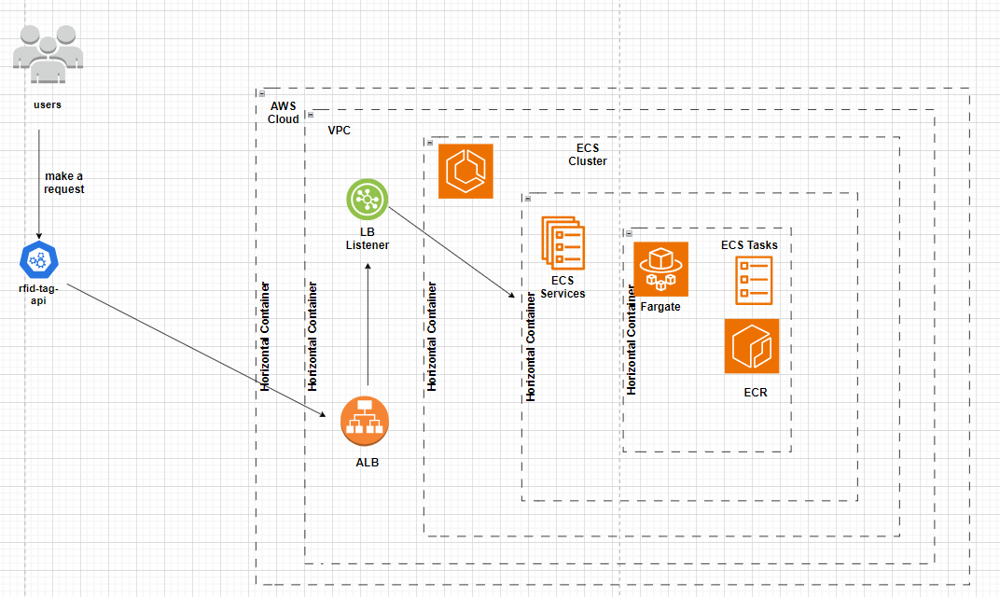

# RFID TAG API

## Introduction

The RFID Tag API is a Java-based microservice built with Spring Boot Framework and JDK 21. It is designed to facilitate
RFID tag management, offering endpoints for creating, retrieving, updating, and deleting tags. Whether you're managing
inventory, tracking assets, or implementing access control, this API provides a convenient solution for integrating RFID
tag management functionality into your applications.

## Installation

To run this API locally, follow these steps:

* Clone this repository.
* Run "mvn clean intsall"
* Access the API endpoints at http://localhost:8080/rfid-tag-api/.

## Endpoints (Locally)

1. Fetch RFID Tags: GET http://localhost:8080/rfid-tag-api/
2. Create new RFID Tag: POST http://localhost:8080/rfid-tag-api/radio-freq-identification
3. Update existing RFID Tag: PUT http://localhost:8080/rfid-tag-api/radio-freq-identification/{id}
4. Delete existing RFID Tag: DELETE http://localhost:8080/rfid-tag-api/radio-freq-identification/{id}

## Endpoints (on AWS)

1. Fetch RFID Tags: GET http://rfid-16860863.eu-west-1.elb.amazonaws.com:8080/rfid-tag-api/
2. Create new RFID Tag: POST http://rfid-16860863.eu-west-1.elb.amazonaws.com:8080/rfid-tag-api/radio-freq-identification
3. Update existing RFID Tag: PUT http://rfid-16860863.eu-west-1.elb.amazonaws.com:8080/rfid-tag-api/radio-freq-identification/{id}
4. Delete existing RFID Tag: DELETE http://rfid-16860863.eu-west-1.elb.amazonaws.com:8080/rfid-tag-api/radio-freq-identification/{id}

## Swagger Documentation

Explore and test the API endpoints using Swagger UI:

* Swagger UI : http://localhost:8080/rfid-tag-api/swagger-ui.html
* API Docs: http://localhost:8080/rfid-tag-api/api-docs

## AWS Service

